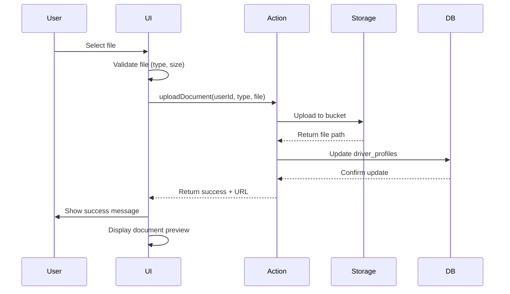

# Design Document

## Overview

The driver dashboard will be a comprehensive document management system that allows female drivers to upload, view, and manage their verification documents. The system uses Supabase for backend storage and database management with RLS policies disabled for direct access. The frontend is built with Next.js 16, React 19, and Tailwind CSS.

## Architecture

### Technology Stack
- **Frontend**: Next.js 16 (App Router), React 19, TypeScript, Tailwind CSS
- **Backend**: Supabase (PostgreSQL database + Storage)
- **Authentication**: Supabase Auth
- **File Storage**: Supabase Storage buckets

### High-Level Architecture

```
┌─────────────────┐
│  Driver Browser │
└────────┬────────┘
         │
         ▼
┌─────────────────────────┐
│  Next.js App Router     │
│  - Driver Dashboard UI  │
│  - Document Upload      │
│  - Profile Management   │
└────────┬────────────────┘
         │
         ▼
┌─────────────────────────┐
│  Supabase Backend       │
│  - PostgreSQL DB        │
│  - Storage Buckets      │
│  - Auth (existing)      │
└─────────────────────────┘
```

## Database Schema

### New Table: driver_profiles

```sql
CREATE TABLE driver_profiles (
  id UUID PRIMARY KEY DEFAULT gen_random_uuid(),
  user_id UUID UNIQUE NOT NULL REFERENCES auth.users(id) ON DELETE CASCADE,
  phone VARCHAR(20) NOT NULL,
  gender VARCHAR(10) NOT NULL CHECK (gender = 'female'),

  -- Document URLs
  government_id_url TEXT,
  selfie_url TEXT,
  driving_license_url TEXT,
  car_rc_url TEXT,
  number_plate_url TEXT,
  car_photos_urls TEXT[], -- Array for multiple car photos

  -- Document upload timestamps
  government_id_uploaded_at TIMESTAMPTZ,
  selfie_uploaded_at TIMESTAMPTZ,
  driving_license_uploaded_at TIMESTAMPTZ,
  car_rc_uploaded_at TIMESTAMPTZ,
  number_plate_uploaded_at TIMESTAMPTZ,
  car_photos_uploaded_at TIMESTAMPTZ,

  -- Profile status
  documents_complete BOOLEAN DEFAULT FALSE,
  profile_verified BOOLEAN DEFAULT FALSE,

  created_at TIMESTAMPTZ DEFAULT NOW(),
  updated_at TIMESTAMPTZ DEFAULT NOW()
);

-- Disable RLS as requested
ALTER TABLE driver_profiles DISABLE ROW LEVEL SECURITY;

-- Create index for faster lookups
CREATE INDEX idx_driver_profiles_user_id ON driver_profiles(user_id);
```

## Supabase Storage

### Storage Bucket: driver-documents

```javascript
// Bucket configuration
{
  name: 'driver-documents',
  public: false, // Private bucket for security
  fileSizeLimit: 10485760, // 10MB per file
  allowedMimeTypes: ['image/jpeg', 'image/png', 'image/jpg', 'application/pdf']
}
```

### File Organization Structure

```
driver-documents/
  ├── {user_id}/
  │   ├── government-id.{ext}
  │   ├── selfie.{ext}
  │   ├── driving-license.{ext}
  │   ├── car-rc.{ext}
  │   ├── number-plate.{ext}
  │   └── car-photos/
  │       ├── photo-1.{ext}
  │       ├── photo-2.{ext}
  │       └── photo-3.{ext}
```

## Components and Interfaces

### 1. Driver Dashboard Page (`app/driver/page.tsx`)
- Main dashboard layout (already exists)
- Will integrate document management section

### 2. Document Upload Component (`components/driver/document-upload.tsx`)
- Handles file selection and upload
- Displays upload progress
- Shows success/error messages
- Props:
  ```typescript
  interface DocumentUploadProps {
    documentType: DocumentType
    currentUrl?: string
    onUploadComplete: (url: string) => void
  }
  ```

### 3. Document Preview Component (`components/driver/document-preview.tsx`)
- Displays uploaded document thumbnails
- Allows viewing full-size documents
- Provides download functionality
- Props:
  ```typescript
  interface DocumentPreviewProps {
    documentUrl: string
    documentType: DocumentType
    uploadedAt?: Date
  }
  ```

### 4. Profile Form Component (`components/driver/profile-form.tsx`)
- Phone number input with validation
- Gender display (read-only, set during registration)
- Profile completion status
- Props:
  ```typescript
  interface ProfileFormProps {
    initialData?: DriverProfile
    onSave: (data: Partial<DriverProfile>) => Promise<void>
  }
  ```

### 5. Document Status Component (`components/driver/document-status.tsx`)
- Shows checklist of required documents
- Indicates which documents are uploaded
- Displays overall completion percentage

## Data Models

### TypeScript Interfaces

```typescript
// Document types
type DocumentType =
  | 'government_id'
  | 'selfie'
  | 'driving_license'
  | 'car_rc'
  | 'number_plate'
  | 'car_photos'

// Driver profile
interface DriverProfile {
  id: string
  user_id: string
  phone: string
  gender: 'female'

  government_id_url?: string
  selfie_url?: string
  driving_license_url?: string
  car_rc_url?: string
  number_plate_url?: string
  car_photos_urls?: string[]

  government_id_uploaded_at?: Date
  selfie_uploaded_at?: Date
  driving_license_uploaded_at?: Date
  car_rc_uploaded_at?: Date
  number_plate_uploaded_at?: Date
  car_photos_uploaded_at?: Date

  documents_complete: boolean
  profile_verified: boolean

  created_at: Date
  updated_at: Date
}

// Upload response
interface UploadResponse {
  success: boolean
  url?: string
  error?: string
}

// Document status
interface DocumentStatus {
  type: DocumentType
  uploaded: boolean
  url?: string
  uploadedAt?: Date
}
```

## API Routes and Server Actions

### Server Actions (`app/driver/actions.ts`)

```typescript
// Get driver profile
async function getDriverProfile(userId: string): Promise<DriverProfile | null>

// Create or update driver profile
async function upsertDriverProfile(data: Partial<DriverProfile>): Promise<DriverProfile>

// Upload document
async function uploadDocument(
  userId: string,
  documentType: DocumentType,
  file: File
): Promise<UploadResponse>

// Delete document
async function deleteDocument(
  userId: string,
  documentType: DocumentType
): Promise<{ success: boolean }>

// Get signed URL for viewing document
async function getDocumentUrl(path: string): Promise<string>
```

## File Upload Flow



## Error Handling

### Client-Side Validation
- File type validation (JPEG, PNG, PDF only)
- File size validation (max 10MB)
- Required field validation (phone number)
- Format validation (phone number format)

### Server-Side Error Handling
- Database connection errors
- Storage upload failures
- Authentication errors
- File size/type violations
- Duplicate upload handling

### Error Messages
```typescript
const ERROR_MESSAGES = {
  INVALID_FILE_TYPE: 'Please upload a JPEG, PNG, or PDF file',
  FILE_TOO_LARGE: 'File size must be less than 10MB',
  UPLOAD_FAILED: 'Failed to upload document. Please try again',
  INVALID_PHONE: 'Please enter a valid phone number',
  GENDER_MISMATCH: 'Only female drivers can register',
  NETWORK_ERROR: 'Network error. Please check your connection',
}
```

## Testing Strategy

### Unit Tests
- Document upload validation logic
- Phone number validation
- File type/size validation
- URL generation functions

### Integration Tests
- Complete document upload flow
- Profile creation and update
- Document replacement
- Storage bucket operations

### Manual Testing Checklist
- Upload each document type
- Replace existing documents
- View uploaded documents
- Update phone number
- Verify gender enforcement
- Test with various file types and sizes
- Test error scenarios (network failure, invalid files)

## Security Considerations

### Storage Security
- Private bucket (not publicly accessible)
- Signed URLs for document viewing (time-limited)
- User-specific folder structure
- File type restrictions

### Database Security
- RLS disabled as requested (direct access)
- Foreign key constraints to auth.users
- Gender check constraint (must be 'female')
- Cascade delete on user deletion

### Input Validation
- Server-side file validation
- Phone number format validation
- Sanitize file names
- Prevent path traversal attacks

## UI/UX Design

### Document Upload Section Layout
```
┌─────────────────────────────────────────┐
│  Document Management                     │
├─────────────────────────────────────────┤
│  Progress: 4/6 documents uploaded        │
│  [████████░░] 67%                        │
├─────────────────────────────────────────┤
│  ┌──────────┐  ┌──────────┐             │
│  │ Gov ID   │  │ Selfie   │             │
│  │ [✓]      │  │ [✓]      │             │
│  │ [View]   │  │ [View]   │             │
│  └──────────┘  └──────────┘             │
│                                          │
│  ┌──────────┐  ┌──────────┐             │
│  │ License  │  │ Car RC   │             │
│  │ [✓]      │  │ [Upload] │             │
│  │ [View]   │  │          │             │
│  └──────────┘  └──────────┘             │
│                                          │
│  ┌──────────┐  ┌──────────┐             │
│  │ Plate    │  │ Car Pics │             │
│  │ [Upload] │  │ [✓]      │             │
│  │          │  │ [View]   │             │
│  └──────────┘  └──────────┘             │
└─────────────────────────────────────────┘
```

### Profile Information Section
```
┌─────────────────────────────────────────┐
│  Profile Information                     │
├─────────────────────────────────────────┤
│  Phone Number: [+1234567890    ] [Save] │
│  Gender: Female ✓                        │
│  Status: Documents Pending               │
└─────────────────────────────────────────┘
```

## Performance Considerations

- Lazy load document previews
- Compress images before upload (client-side)
- Use Next.js Image component for thumbnails
- Implement upload progress indicators
- Cache driver profile data
- Optimize database queries with indexes

## Future Enhancements

- Document verification status (admin review)
- OCR for automatic data extraction
- Real-time upload progress
- Bulk photo upload for car photos
- Document expiration tracking
- Push notifications for verification status
